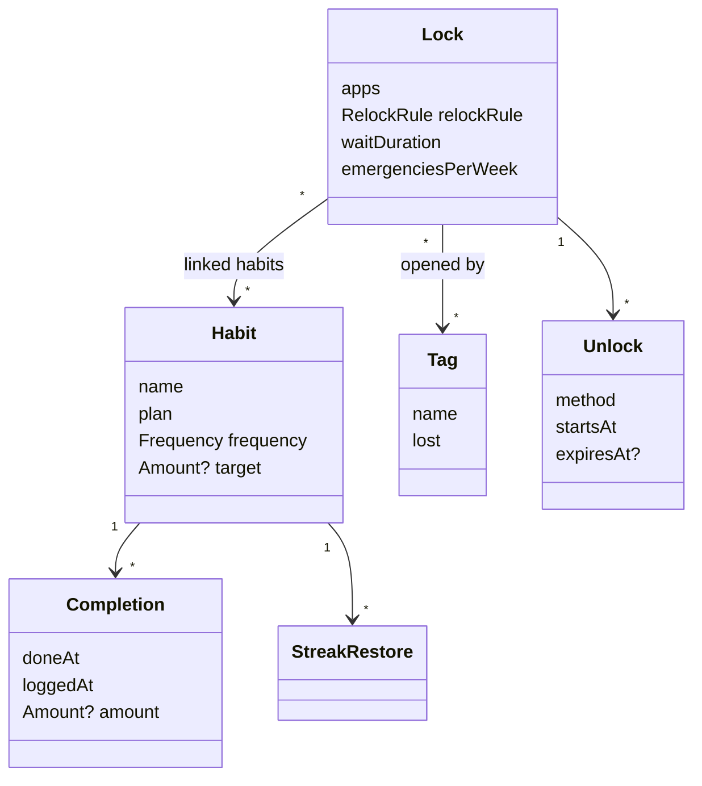
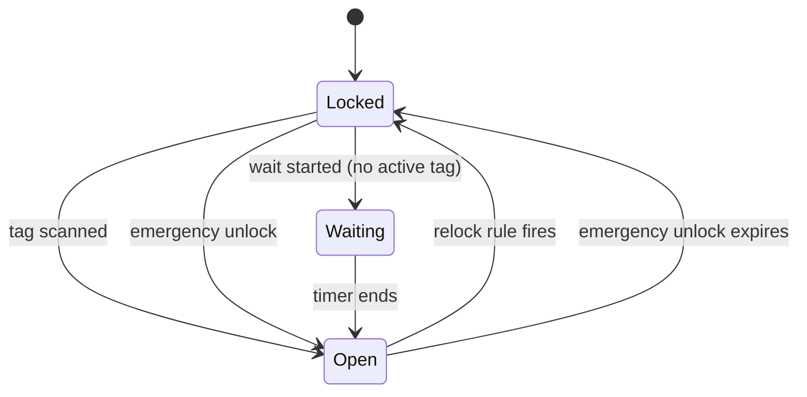

# Domain model

What exists in Déclic, what each thing holds, and the rules between them. No
Android, no database, no screens here. This is what the `domain` package will
implement as plain Kotlin.

One principle runs through all of it: **store what happened, compute the
state.** We never store "this lock is locked" or "the streak is 12". We store
unlocks and completions, and compute lock states and streaks from them when
needed. Nothing can get out of sync, it survives reboots and process death, and
the rules can be tested by just passing a different "now".

## Entities

Things with an identity that lasts over time. Every id is a UUID, so data could
be synced to a backend later without clashing.

| Entity | Holds |
|---|---|
| **Habit** | name, plan ("at the mirror, after waking up"), frequency, optional amount target, archived or not |
| **Completion** | the habit, when it was done, when it was logged, optional amount |
| **Lock** | name, blocked apps, relock rule, wait duration, emergency unlocks per week, linked habits, linked tags, pending loosening changes |
| **Tag** | the id written on the tag, a name ("Bathroom"), active or lost |
| **Unlock** | the lock, the method (tag, wait, emergency), when it starts, when it expires if it does |
| **StreakRestore** | the habit, the missed period it covers, when it was used |

## Value objects

Defined only by their values, no identity.

| Value | Meaning |
|---|---|
| **Frequency** | a count per period: 2 per day, 3 per week |
| **Amount** | a number and a unit: 2 hours, 10 km |
| **RelockRule** | either "N hours after the last unlock" or "at these times of day" |
| **Period** | one logical day or one week, the unit streaks are counted in |

## Time

- **A day starts at 4:00**, not midnight, and the hour is adjustable. Something done at 1:30 belongs to the evening before. People who go to bed late shouldn't get their nights cut in half.
- **A week starts on Monday.**
- Moments in time are stored as instants (a point on the timeline, no time zone). Days and weeks are computed from them in the phone's current time zone.

## Locks

### Locked or not
A lock is open from the start of an unlock until whichever comes first:
- the relock rule fires
- the unlock expires (only emergency unlocks expire)

Otherwise it's locked. A lock that was never unlocked is locked.

The relock rule says when the lock comes back:
- **After N hours:** N hours after the last unlock started.
- **At times of day:** at the first of its times that comes after the last unlock started.

**An app is blocked if at least one lock containing it is locked.**

### How a lock can be opened

| Lock | Ways to open it |
|---|---|
| Has at least one active tag | scan one of its tags, or an emergency unlock |
| Has no tag, or all its tags are lost | wait unlock, or an emergency unlock |

- **Scanning a tag** opens every lock linked to it, right away, with no screen in between. The habits linked to those locks get a prompt that can be answered later.
- **Wait unlock:** starting the timer records an unlock that starts when the timer ends (5 minutes by default, set per lock). Until then the lock is "waiting", still locked. The timer keeps running if you leave the screen.
- **Emergency unlock:** opens the lock for 20 minutes. Each lock allows a number per calendar week (1 by default). Every emergency unlock shows up in the history.
- Unlocks can't be undone.

### Changing a lock
- **Tightening** applies right away: more apps, a shorter relock time, a longer wait, fewer emergencies, a new tag.
- **Loosening** waits for the start of the next day, and the user is asked that day if they still want it: fewer apps, a longer relock time, a shorter wait, more emergencies, removing a tag, deleting the lock.

### Lost tags
Marking a tag as lost makes its locks fall back to the wait unlock (if it was their only tag). Registering a replacement tag brings the tag back as the way in.

## Habits

### Logging
- A completion can be logged up to 24 hours after it was done.
- It counts for the period it was **done** in, not the one it was logged in.
- The amount is optional and doesn't decide whether the habit counts. "Worked on Déclic" counts as done whether it was 20 minutes or 2 hours. The amount is shown against the target.
- Unlocking a lock never logs a habit by itself. Scanning the tag at noon without doing the routine must not count.

### Streaks
- A period is **met** when its completions reach the frequency's count. Skincare 2 per day needs 2 completions that day. Gym 3 per week needs 3 that week.
- The streak is the number of met periods in a row, counting back from the last finished period. The current period can add to the streak once it's met, but it can't break it while it's still going.
- **Restore:** a missed period can be marked as restored, and then counts as met. 3 restores per habit per calendar month.
- **Completion rate:** met periods divided by finished periods since the habit was created.

## Later

Ideas that came up and don't belong in v1:
- Week start depending on the region, or set in settings
- A setting that stops the wait timer if you leave the lock screen
- A rule that unlocks automatically at a time ("block TikTok from 9 to 17")
- Pause mode for sick days and holidays
